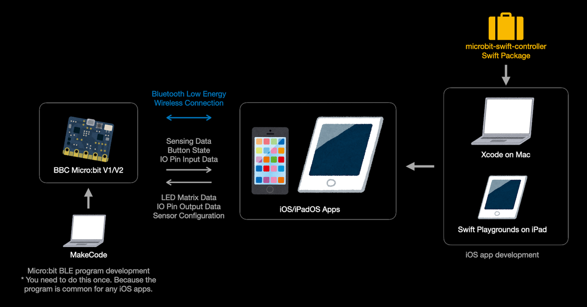

# microbit-swift-controller

An experimental Swift Package for developing apps that communicate with BBC Micro:bit via Bluetooth Low Energy (BLE).

- Target devices: iPhone / iPad / Mac with Apple Silicon (Designed for iPad)
- Target OS: iOS 16.0+, iPadOS 16.0+, macOS 13.0+
- Build system: Xcode 14.3+, Swift Playground 4 on iPadOS
- SDK: CoreBluetooth
- BBC Micro:bit: V1/V2

The Swift Package helps you create apps that interact with BBC Micro:bit via BLE.

The Micro:bit runs a general BLE peripheral program that enables BLE services you want such as LED, ACCELEROMETER, and IO PIN.
Once you download the program into your Micro:bit, you can use it commonly for any iOS apps that communicate with the BLE services.

By using the Apple CoreBluetooth framework, you can make any apps that communicate with Micro:bit via BLE.
However, you need to follow many procedures to match the Micro:bit's BLE Profile requirements.

This swift package provide two levels APIs to make easy creating such apps.

1. State-less Synchronous APIs ... With these APIs, you don't need to care about BLE states and Asynchronous behaviour. This is suitable for programming education for beginners.
1. State-full Asynchronous APIs ... With these APIs, you can handle precise BLE states and errors. You use Swift Concurrency for their asynchronous functions.

License: MIT
